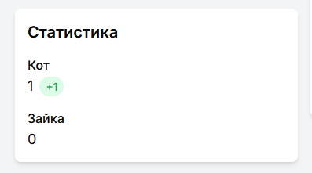

<div align="center">

# Wishlist 🐰🐈‍⬛

## Features

```
- Wishlist System
- Author & Category filters
- Simple Authorization
- Simple Points and Statistics System
- PostgreSQL + Prisma Database
```

### Auth Page:


### Wish Cards:


### Wish Categories:


### Stats:



</div>

## How to deploy on your machine:

1. Make sure you have [PostgreSQL](https://www.postgresql.org/download/windows/) installed on your machine. You can check it with such command:

```bash
postgres --version
```

2. Clone the repository:

```bash
git clone https://github.com/worldspawn-web/wishlist-bunnycat.git
cd wishlist-bunnycat
```

3. Install required dependencies:

```bash
npm install
```

4. Create `.env` in a project root. It must look like this:

```
DATABASE_URL="postgresql://<USERNAME>:<PASSWORD>@<HOST>/<DATABASE>?schema=public"

Where:
<USERNAME> - Your PostgreSQL username
<PASSWORD> - Your PostgreSQL password
<HOST> - Your PostgreSQL hostname (by default it's: localhost:5432)
<DATABASE> - Your future database name (will be created later)

P.S. Don't forget to remove "<>" symbols, that was for an example only.
```

5. Create your local database:

```bash
npx prisma db push
```

6. Run the development server:

```bash
npm run dev
# or
yarn dev
# or
pnpm dev
# or
bun dev
```
